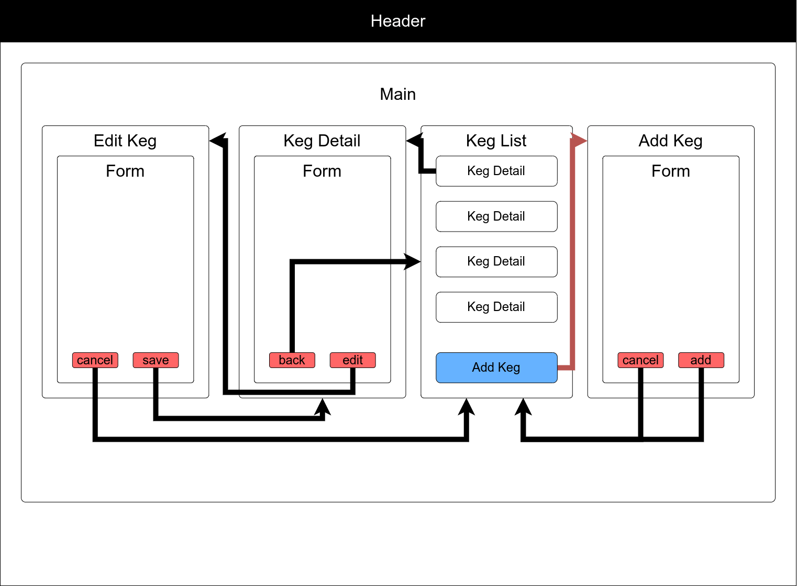

# 
 🍻 Phil's Taproom 🍻 

#### A web-based React application for managing inventory.

#### by **Phil Curran** ~ June 5, 2022

## Table of Contents

1. [Technologies Used](#technologies)
2. [Description](#description)
3. [Component Map](#componentMap)
4. [Setup/Installation Requirements](#setup)
5. [Known Bugs](#bugs)
6. [License](#license)
7. [Contact Information](#contact)

## Technologies Used 

- HTML
- CSS / Bulma
- React
- NPM & Webpack

## Description 

This app allows you to track the inventory of a taproom by adding, deleting, and monitoring the level of the kegs in the system.  Responsive messaging tells you whether the keg is full or getting close to being empty with conditional rendering.

## Component Map 

## Project Setup/Installation Instructions 

### Clone the project

- Open the terminal on your local computer.
- Navigate to the parent directory of your preference.
- Clone this project: <code>git clone https://github.com/phil-curran/phils-taproom.git</code>

### Install Dependencies

- From the root directory, run: <code>npm install</code>

### Run the project

- From the root directory, run: <code>npm start</code>

## Known Bugs 

- deleteKeg and kegDetails functions not currently working / in progress.
- Future iterations may use ReactRouter to navigate between pages / page elements.

## License 

[MIT License](https://opensource.org/licenses/MIT) © 2022

## Contact 

Phil Curran [pecurran@hotmail.com](mailto:pecurran@hotmail.com) [LinkedIn](https://www.linkedin.com/in/philcurran/) [GitHub](https://github.com/phil-curran)  

